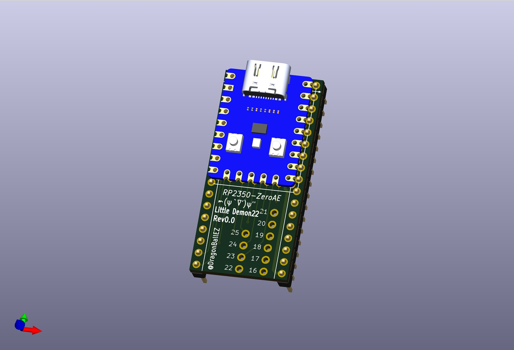
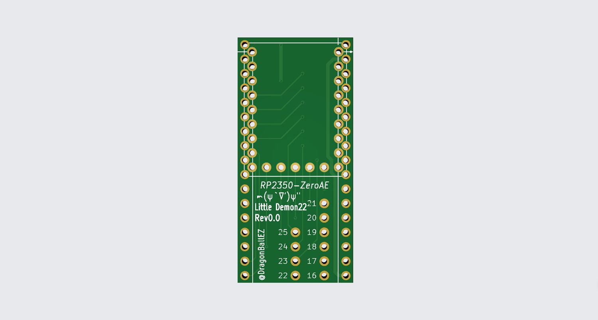
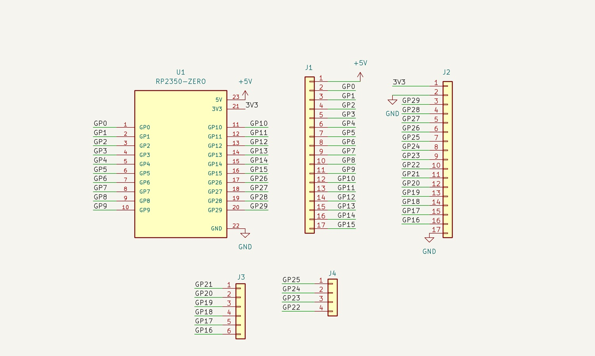

# RP2350_ZeroAE_PCB
Waveshare RP2350-Zero の ピン配置を AE-RP2040 互換にする変換基板

## 部品

- RP2350_ZeroAE基板
- 丸ピンヘッダー 1×40 (40P) 　　　2本
- 丸ピンIC用ソケット (シングル40P)　1本

## 組み立て

参考: [RP2350_ZeroAE - （RP2350 Zero用 AE-RP2040ピン配置変換基板）の組み立て方](https://note.com/quiet_duck4046/n/nb59c8c9d06eb?sub_rt=share_sb)

## イメージ・回路図

